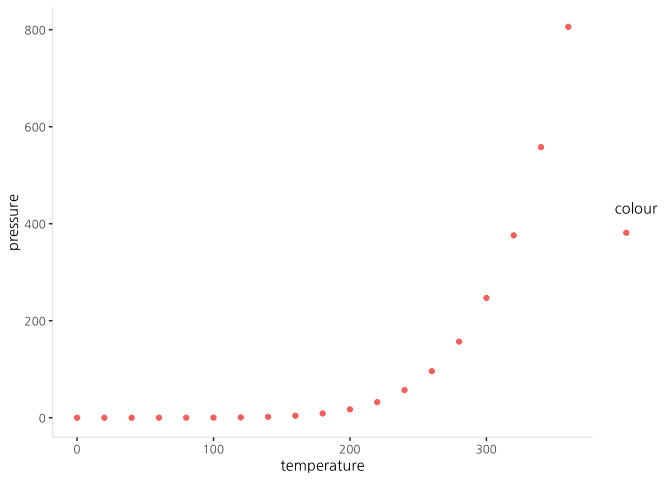

## R Markdown

This is an R Markdown document. Markdown is a simple formatting syntax for authoring HTML, PDF, and MS Word documents. For more details on using R Markdown see <http://rmarkdown.rstudio.com>.

엠포스에서 빅데이터 분석을 해봤습니다~~~<http://http://www.emforce.co.kr>

When you click the **Knit** button a document will be generated that includes both content as well as the output of any embedded R code chunks within the document. You can embed an R code chunk like this:


```r
summary(cars)
```

```
##      speed           dist       
##  Min.   : 4.0   Min.   :  2.00  
##  1st Qu.:12.0   1st Qu.: 26.00  
##  Median :15.0   Median : 36.00  
##  Mean   :15.4   Mean   : 42.98  
##  3rd Qu.:19.0   3rd Qu.: 56.00  
##  Max.   :25.0   Max.   :120.00
```


```
## 'data.frame':	50 obs. of  2 variables:
##  $ speed: num  4 4 7 7 8 9 10 10 10 11 ...
##  $ dist : num  2 10 4 22 16 10 18 26 34 17 ...
```

## Including Plots

You can also embed plots, for example:


Note that the `echo = FALSE` parameter was added to the code chunk to prevent printing of the R code that generated the plot.


```r
require(ggplot2)
require(plotly)

hhj_theme <- theme_classic(base_family="NanumGothic") +
  theme(#axis.text.x = element_text(angle = 45),
    strip.background = element_rect(colour = "white", fill = "white"), 
    axis.line = element_line(colour = "#EBEBEB"), 
    panel.spacing = unit(1, "lines")
  )

theme_set(hhj_theme)
```


```r
p <- ggplot(pressure, aes(temperature, pressure, color = "")) +
  geom_point()

#call
htmltools::div(ggplotly(p), align="center") 
```

<!--html_preserve--><div align="center">
<div id="htmlwidget-e6b61ac6fbec703ddda3" style="width:100%;height:400px;" class="plotly html-widget"></div>
<script type="application/json" data-for="htmlwidget-e6b61ac6fbec703ddda3">{"x":{"data":[{"x":[0,20,40,60,80,100,120,140,160,180,200,220,240,260,280,300,320,340,360],"y":[0.0002,0.0012,0.006,0.03,0.09,0.27,0.75,1.85,4.2,8.8,17.3,32.1,57,96,157,247,376,558,806],"text":["temperature:   0<br />pressure:   0.0002<br />colour: ","temperature:  20<br />pressure:   0.0012<br />colour: ","temperature:  40<br />pressure:   0.0060<br />colour: ","temperature:  60<br />pressure:   0.0300<br />colour: ","temperature:  80<br />pressure:   0.0900<br />colour: ","temperature: 100<br />pressure:   0.2700<br />colour: ","temperature: 120<br />pressure:   0.7500<br />colour: ","temperature: 140<br />pressure:   1.8500<br />colour: ","temperature: 160<br />pressure:   4.2000<br />colour: ","temperature: 180<br />pressure:   8.8000<br />colour: ","temperature: 200<br />pressure:  17.3000<br />colour: ","temperature: 220<br />pressure:  32.1000<br />colour: ","temperature: 240<br />pressure:  57.0000<br />colour: ","temperature: 260<br />pressure:  96.0000<br />colour: ","temperature: 280<br />pressure: 157.0000<br />colour: ","temperature: 300<br />pressure: 247.0000<br />colour: ","temperature: 320<br />pressure: 376.0000<br />colour: ","temperature: 340<br />pressure: 558.0000<br />colour: ","temperature: 360<br />pressure: 806.0000<br />colour: "],"type":"scatter","mode":"markers","marker":{"autocolorscale":false,"color":"rgba(248,118,109,1)","opacity":1,"size":5.66929133858268,"symbol":"circle","line":{"width":1.88976377952756,"color":"rgba(248,118,109,1)"}},"hoveron":"points","legendgroup":"","showlegend":true,"xaxis":"x","yaxis":"y","hoverinfo":"text","frame":null}],"layout":{"margin":{"t":26.2283105022831,"r":7.30593607305936,"b":40.1826484018265,"l":43.1050228310502},"plot_bgcolor":"rgba(255,255,255,1)","paper_bgcolor":"rgba(255,255,255,1)","font":{"color":"rgba(0,0,0,1)","family":"NanumGothic","size":14.6118721461187},"xaxis":{"domain":[0,1],"automargin":true,"type":"linear","autorange":false,"range":[-18,378],"tickmode":"array","ticktext":["0","100","200","300"],"tickvals":[0,100,200,300],"categoryorder":"array","categoryarray":["0","100","200","300"],"nticks":null,"ticks":"outside","tickcolor":"rgba(51,51,51,1)","ticklen":3.65296803652968,"tickwidth":0.66417600664176,"showticklabels":true,"tickfont":{"color":"rgba(77,77,77,1)","family":"NanumGothic","size":11.689497716895},"tickangle":-0,"showline":true,"linecolor":"rgba(235,235,235,1)","linewidth":0.66417600664176,"showgrid":false,"gridcolor":null,"gridwidth":0,"zeroline":false,"anchor":"y","title":"temperature","titlefont":{"color":"rgba(0,0,0,1)","family":"NanumGothic","size":14.6118721461187},"hoverformat":".2f"},"yaxis":{"domain":[0,1],"automargin":true,"type":"linear","autorange":false,"range":[-40.29979,846.29999],"tickmode":"array","ticktext":["0","200","400","600","800"],"tickvals":[0,200,400,600,800],"categoryorder":"array","categoryarray":["0","200","400","600","800"],"nticks":null,"ticks":"outside","tickcolor":"rgba(51,51,51,1)","ticklen":3.65296803652968,"tickwidth":0.66417600664176,"showticklabels":true,"tickfont":{"color":"rgba(77,77,77,1)","family":"NanumGothic","size":11.689497716895},"tickangle":-0,"showline":true,"linecolor":"rgba(235,235,235,1)","linewidth":0.66417600664176,"showgrid":false,"gridcolor":null,"gridwidth":0,"zeroline":false,"anchor":"x","title":"pressure","titlefont":{"color":"rgba(0,0,0,1)","family":"NanumGothic","size":14.6118721461187},"hoverformat":".2f"},"shapes":[{"type":"rect","fillcolor":null,"line":{"color":null,"width":0,"linetype":[]},"yref":"paper","xref":"paper","x0":0,"x1":1,"y0":0,"y1":1}],"showlegend":true,"legend":{"bgcolor":"rgba(255,255,255,1)","bordercolor":"transparent","borderwidth":1.88976377952756,"font":{"color":"rgba(0,0,0,1)","family":"NanumGothic","size":11.689497716895},"y":0.913385826771654},"annotations":[{"text":"colour","x":1.02,"y":1,"showarrow":false,"ax":0,"ay":0,"font":{"color":"rgba(0,0,0,1)","family":"NanumGothic","size":14.6118721461187},"xref":"paper","yref":"paper","textangle":-0,"xanchor":"left","yanchor":"bottom","legendTitle":true}],"hovermode":"closest","barmode":"relative"},"config":{"doubleClick":"reset","modeBarButtonsToAdd":[{"name":"Collaborate","icon":{"width":1000,"ascent":500,"descent":-50,"path":"M487 375c7-10 9-23 5-36l-79-259c-3-12-11-23-22-31-11-8-22-12-35-12l-263 0c-15 0-29 5-43 15-13 10-23 23-28 37-5 13-5 25-1 37 0 0 0 3 1 7 1 5 1 8 1 11 0 2 0 4-1 6 0 3-1 5-1 6 1 2 2 4 3 6 1 2 2 4 4 6 2 3 4 5 5 7 5 7 9 16 13 26 4 10 7 19 9 26 0 2 0 5 0 9-1 4-1 6 0 8 0 2 2 5 4 8 3 3 5 5 5 7 4 6 8 15 12 26 4 11 7 19 7 26 1 1 0 4 0 9-1 4-1 7 0 8 1 2 3 5 6 8 4 4 6 6 6 7 4 5 8 13 13 24 4 11 7 20 7 28 1 1 0 4 0 7-1 3-1 6-1 7 0 2 1 4 3 6 1 1 3 4 5 6 2 3 3 5 5 6 1 2 3 5 4 9 2 3 3 7 5 10 1 3 2 6 4 10 2 4 4 7 6 9 2 3 4 5 7 7 3 2 7 3 11 3 3 0 8 0 13-1l0-1c7 2 12 2 14 2l218 0c14 0 25-5 32-16 8-10 10-23 6-37l-79-259c-7-22-13-37-20-43-7-7-19-10-37-10l-248 0c-5 0-9-2-11-5-2-3-2-7 0-12 4-13 18-20 41-20l264 0c5 0 10 2 16 5 5 3 8 6 10 11l85 282c2 5 2 10 2 17 7-3 13-7 17-13z m-304 0c-1-3-1-5 0-7 1-1 3-2 6-2l174 0c2 0 4 1 7 2 2 2 4 4 5 7l6 18c0 3 0 5-1 7-1 1-3 2-6 2l-173 0c-3 0-5-1-8-2-2-2-4-4-4-7z m-24-73c-1-3-1-5 0-7 2-2 3-2 6-2l174 0c2 0 5 0 7 2 3 2 4 4 5 7l6 18c1 2 0 5-1 6-1 2-3 3-5 3l-174 0c-3 0-5-1-7-3-3-1-4-4-5-6z"},"click":"function(gd) { \n        // is this being viewed in RStudio?\n        if (location.search == '?viewer_pane=1') {\n          alert('To learn about plotly for collaboration, visit:\\n https://cpsievert.github.io/plotly_book/plot-ly-for-collaboration.html');\n        } else {\n          window.open('https://cpsievert.github.io/plotly_book/plot-ly-for-collaboration.html', '_blank');\n        }\n      }"}],"cloud":false},"source":"A","attrs":{"fb4257c9b":{"x":{},"y":{},"colour":{},"type":"scatter"}},"cur_data":"fb4257c9b","visdat":{"fb4257c9b":["function (y) ","x"]},"highlight":{"on":"plotly_click","persistent":false,"dynamic":false,"selectize":false,"opacityDim":0.2,"selected":{"opacity":1},"debounce":0},"base_url":"https://plot.ly"},"evals":["config.modeBarButtonsToAdd.0.click"],"jsHooks":[]}</script>
</div><!--/html_preserve-->


```r
p
```



## Conclusion

엠포스의 빅데이터 분석을 통해 마케팅 분야의 ...
